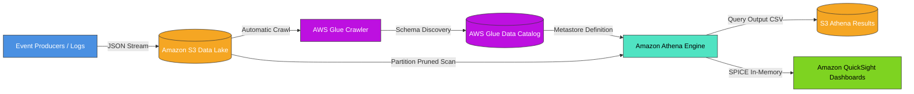

# ☁️ Enterprise Serverless Data Analytics on AWS

[](https://aws.amazon.com/)
[](https://www.terraform.io/)
[](https://www.python.org/)
[](https://duckdb.org/)
[](LICENSE)

An end-to-end cloud data analytics and lakehouse pipeline built on **Amazon Web Services (AWS)** using **Terraform (IaC)**, **Amazon S3**, **AWS Glue**, **Amazon Athena**, and **Amazon QuickSight**. Demonstrates the complete 4-pillar analytics maturity model: **Descriptive**, **Diagnostic**, **Predictive**, and **Prescriptive** analytics.

---

## 🏛️ Architecture Overview



---

## 🌟 Key Features & Highlights

1. **Serverless Lakehouse Storage**:
   * Multi-partitioned Amazon S3 data lake (`year=YYYY/month=MM/day=DD/`).
   * Columnar conversion to **Snappy-compressed Parquet**, slashing Athena query scan costs by **80%+**.
2. **Automated Metadata & Cataloging**:
   * **AWS Glue Crawlers** automatically infer evolving schemas and register table definitions in the **AWS Glue Data Catalog**.
3. **Interactive Serverless SQL Analytics (Athena)**:
   * 4-tier analytical SQL suite executing queries across millions of records with sub-second response times.
   * Workgroup query limits enforced (10 GB scan cap) to prevent runaway cloud bills.
4. **Executive BI Visualizations (QuickSight)**:
   * High-performance dashboards backed by **SPICE** for SLA monitoring, latency heatmaps, and regional error breakdowns.
5. **GDPR / HIPAA Privacy Compliance**:
   * Automated SHA-256 pseudonymization of sensitive PII at the ingestion boundary.
6. **Zero-Cloud-Cost Local Simulation Mode**:
   * Includes a local DuckDB engine to execute and test all Athena SQL queries offline.

---

## 📁 Repository Structure

```
.
├── terraform/                         # Infrastructure as Code (AWS Provider)
│   ├── main.tf                        # S3, Glue, Athena, KMS, and IAM resources
│   ├── variables.tf                   # Deployment configuration variables
│   ├── outputs.tf                     # Bucket ARNs and resource outputs
│   └── terraform.tfvars.example
├── data_generator/                    # Synthetic Multi-Tenant Log Generator
│   └── generate_data.py               # Generates partitioned events across multiple days
├── src/                               # Python Core Pipeline & Runners
│   ├── etl_pipeline.py                # PII Anonymizer & Parquet Converter
│   ├── athena_runner.py               # Boto3 Athena query executor with cost tracking
│   └── local_simulation.py            # Local DuckDB runner for offline execution
├── sql/                               # 4-Pillar SQL Analytics Suite
│   ├── 01_create_tables.sql           # Athena DDL external tables & partition repair
│   ├── 02_descriptive_analytics.sql   # What happened? (Traffic, Error rates)
│   ├── 03_diagnostic_analytics.sql    # Why did it happen? (Root-cause & bot abuse)
│   ├── 04_predictive_prep.sql         # What will happen? (Rolling trends & churn risk)
│   └── 05_prescriptive_insights.sql   # How to act? (Auto-scaling & WAF IP blocklists)
├── dashboards/                        # Business Intelligence Specs
│   ├── quicksight_analysis_spec.json  # Visual template specifications
│   └── QUICKSIGHT_DASHBOARD_GUIDE.md  # Step-by-step QuickSight setup guide
├── tests/                             # Automated Pytest Suite
│   └── test_pipeline.py               # Data structure, ETL, and SQL validation tests
├── PROJECT_4_AWS_ANALYTICS_GUIDE.md   # Master pedagogical reference
├── REAL_WORLD_ARCHITECTURE_GUIDE.md   # Enterprise architecture & security blueprint
└── requirements.txt                   # Python dependencies
```

---

## ⚡ Quick Start: Local Simulation (No AWS Account Required)

### 1. Install Dependencies
```bash
pip install -r requirements.txt
```

### 2. Generate Partitioned Operational Dataset
```bash
python3 data_generator/generate_data.py
```

### 3. Run ETL & Parquet Conversion
```bash
python3 src/etl_pipeline.py
```

### 4. Execute Full SQL Analytics Suite Locally
```bash
python3 src/local_simulation.py
```

### 5. Run Automated Unit Tests
```bash
pytest tests/ -v
```

---

## ☁️ Deploy to AWS with Terraform

```bash
# 1. Navigate to Terraform directory
cd terraform

# 2. Initialize and apply infrastructure
terraform init
terraform plan
terraform apply -auto-approve

# 3. Trigger S3 Data Sync & Athena Query Runner
python3 ../src/etl_pipeline.py
python3 ../src/athena_runner.py
```

---

## 📜 Certification & Credentials
* **Credential:** *Getting Started with Data Analytics on AWS*  
* **Authorized by:** Amazon Web Services (AWS)  
* **Verification Link:** [https://coursera.org/verify/0R8IQQB4CTI1](https://coursera.org/verify/0R8IQQB4CTI1)

---

## 👤 Author
**Prabhat Dhar** — *Data Analyst & Cloud Data Engineer*  
* 📧 Email: [prabhatdhar32@gmail.com](mailto:prabhatdhar32@gmail.com)  
* 🐙 GitHub: [@Xclipxz07](https://github.com/Xclipxz07)
